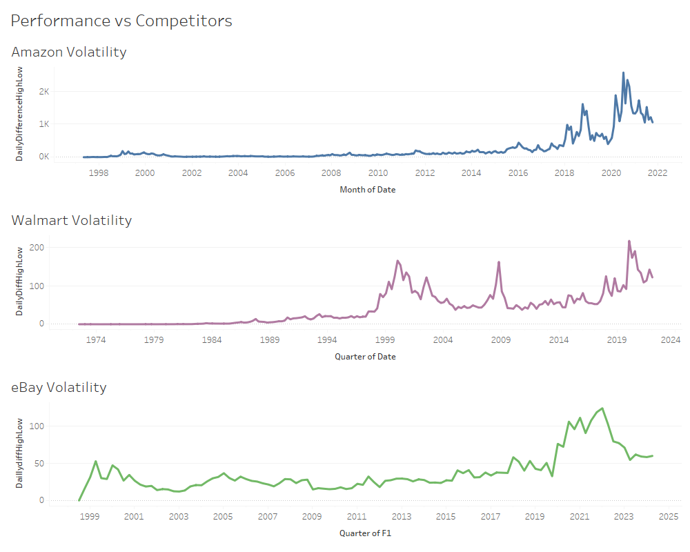
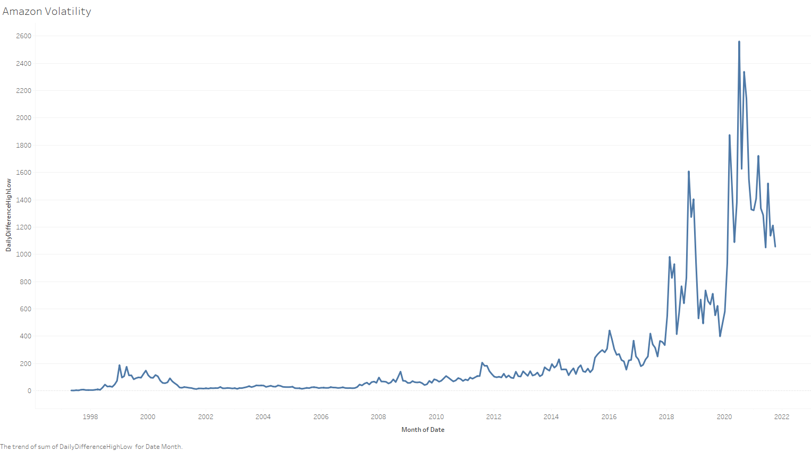

# Amazon Stocks

Interactive dashboards: [Tableau Public](https://public.tableau.com/views/Amazon_17225340065340/GeneralPerformance?:language=en-US&:sid=&:redirect=auth&:display_count=n&:origin=viz_share_link) · [project page](https://cam-leo.github.io/AmazonStocks/)

An analysis of Amazon's daily stock data from 1997 to 2021, compared with Walmart and eBay, using Excel, Power BI and Tableau. A second dashboard explores a practice HR dataset.

## Project Overview

**Goal:** track Amazon's stock performance over time (return, trend and volatility) and compare it with competitors.

1. **Data import and cleaning (Excel):** daily open, high, low, close and adjusted close prices and volume, 1997-2021. 1997 is a partial year, since Amazon listed in May 1997.
2. **Visualisation (Power BI, Tableau):** price trends over time and a comparison with eBay and Walmart.
3. **Volatility:** the daily high-low range, shown below.

## How to Read These Charts

**The volatility charts measure dollar ranges, not risk.** The "volatility" series is the daily high minus low price, in dollars, summed over each month (Amazon) or quarter (Walmart and eBay). This has three problems:

- **It grows with the share price.** Amazon traded at a few dollars a share in the late 1990s (split-adjusted) and over $3,000 in 2020. A 2% daily move is about $0.10 at the first price and $60 at the second. Most of the rise in the Amazon chart is the price going up, not the stock getting riskier.
- **The periods differ.** Amazon is summed by month, Walmart and eBay by quarter, so their totals aren't on the same scale. Sums also depend on how many trading days fall in each period.
- **The companies trade at different prices,** so dollar ranges can't be compared across them.

A comparable measure divides by price, for example the daily range as a percentage of the close, `(High − Low) / Close`, or the standard deviation of daily returns, then averages over each period. With that measure, the dot-com period around 2000 and March 2020 stand out as Amazon's most volatile times.

**Volatility isn't a sign of benefiting.** All three companies show a spike around 2020. That reflects large price swings during the COVID-19 crash and rebound, which is volatility, not gains. Whether a company benefited shows up in its return over the period, such as the change in adjusted close, not in how much its price swung.

**The yearly table shows sums of daily prices.** For example, "1997: 500" is the sum of about 160 daily closing prices, so it grows with the number of trading days as well as with the price. A yearly average or the year-end close would be meaningful.

**The revenue chart isn't from Amazon's reports.** Amazon reports revenue by North America, International and AWS, not APAC / EMEA / NA. Its actual revenue was $386 billion in 2020, while the chart peaks around 1,200K. Treat this chart as coming from a sample dataset until it's replaced with figures from Amazon's annual reports (10-K).

## Key Observations

- Amazon's price history has three clear episodes: the dot-com bubble and crash (around 1999-2001), steady growth through the 2010s, and the COVID-19 swing in 2020.
- The first Prime Day was in July 2015.

**About Prime Day:** an earlier version of this README said Prime Day "has a notable increase in all metrics" and recommended spending more on Prime Day advertising. None of the charts isolate Prime Day. Monthly sums of daily ranges can't show the effect of a single event, and a share price measures what investors expect, not Prime Day sales. Testing the claim would take an event study: compare Amazon's return in the days around each Prime Day with the market's return (e.g. the S&P 500) over the same days. A recommendation about advertising budgets would need sales data, which this dataset doesn't have.

## HR Dashboard

[Interactive version](https://public.tableau.com/views/AmazonHRDashboard/HRSummary?:language=en-US&publish=yes&:sid=&:redirect=auth&:display_count=n&:origin=viz_share_link)

This dashboard uses a **fictional practice HR dataset**, not Amazon employee data. The names, salaries and locations are randomly generated: for example, names and gender icons often don't match. It shows dashboard design (KPIs, filters, drill-down to employee details), not facts about Amazon. The Amazon logo on the dashboard should be removed so it isn't read as real company data.

